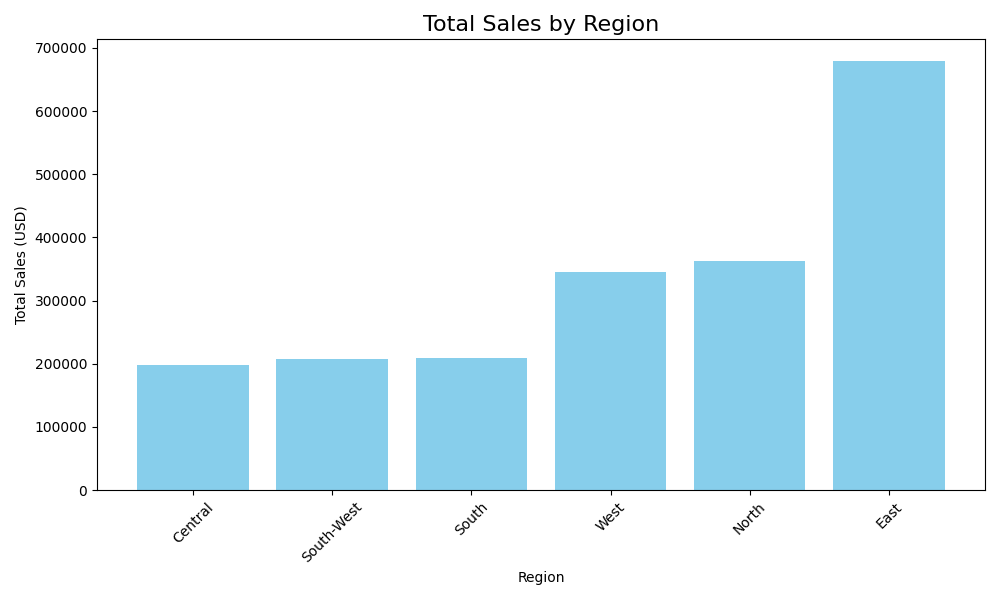
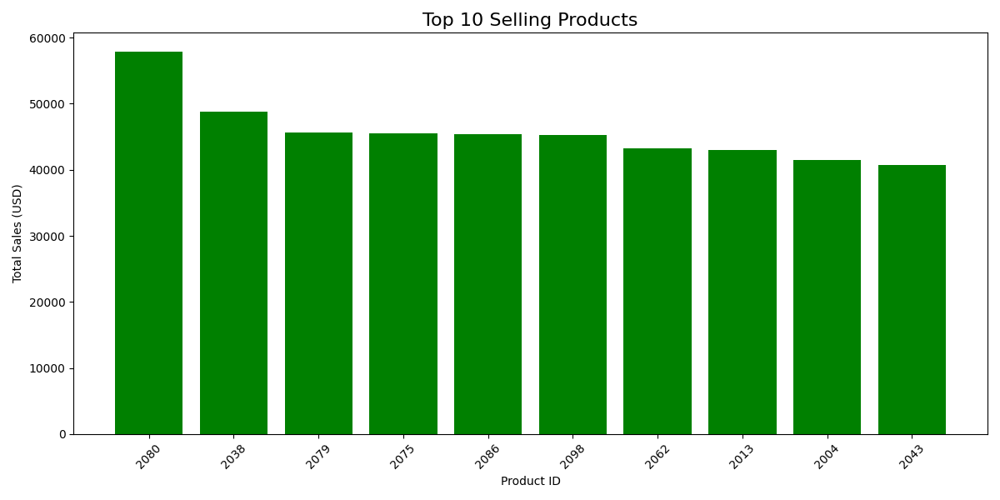
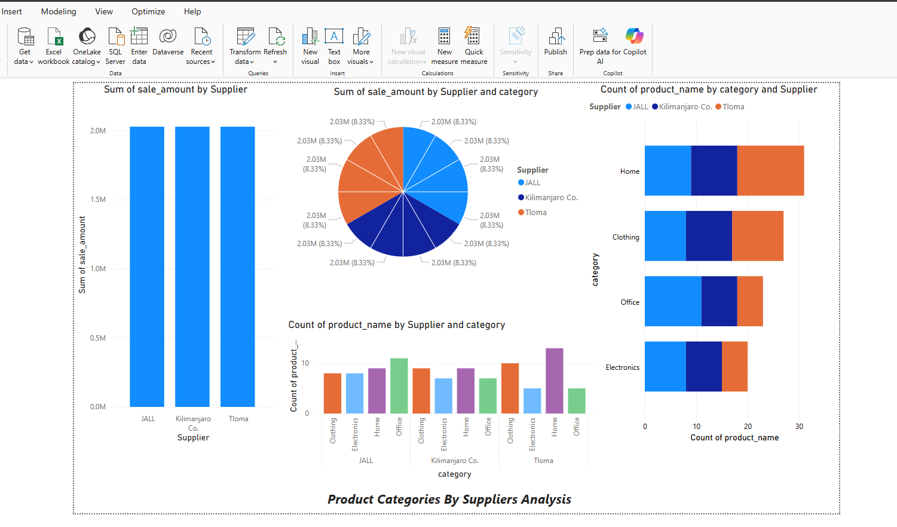

# Pro Analytics 02 Python Starter Repository

> Use this repo to start a professional Python project.

- Additional information: <https://github.com/denisecase/pro-analytics-02>
- Project organization: [STRUCTURE](./STRUCTURE.md)
- Build professional skills:
  - **Environment Management**: Every project in isolation
  - **Code Quality**: Automated checks for fewer bugs
  - **Documentation**: Use modern project documentation tools
  - **Testing**: Prove your code works
  - **Version Control**: Collaborate professionally

---

## WORKFLOW 1. Set Up Your Machine

Proper setup is critical.
Complete each step in the following guide and verify carefully.

- [SET UP MACHINE](./SET_UP_MACHINE.md)

---

## WORKFLOW 2. Set Up Your Project

After verifying your machine is set up, set up a new Python project by copying this template.
Complete each step in the following guide.

- [SET UP PROJECT](./SET_UP_PROJECT.md)

It includes the critical commands to set up your local environment (and activate it):

```shell
uv venv
uv python pin 3.12
uv sync --extra dev --extra docs --upgrade
uv run pre-commit install
uv run python --version
```

**Windows (PowerShell):**

```shell
.\.venv\Scripts\activate
```

**macOS / Linux / WSL:**

```shell
source .venv/bin/activate
```

---

## WORKFLOW 3. Daily Workflow

Please ensure that the prior steps have been verified before continuing.
When working on a project, we open just that project in VS Code.

### 3.1 Git Pull from GitHub

Always start with `git pull` to check for any changes made to the GitHub repo.

```shell
git pull
```

### 3.2 Run Checks as You Work

This mirrors real work where we typically:

1. Update dependencies (for security and compatibility).
2. Clean unused cached packages to free space.
3. Use `git add .` to stage all changes.
4. Run ruff and fix minor issues.
5. Update pre-commit periodically.
6. Run pre-commit quality checks on all code files (**twice if needed**, the first pass may fix things).
7. Run tests.

In VS Code, open your repository, then open a terminal (Terminal / New Terminal) and run the following commands one at a time to check the code.

```shell
uv sync --extra dev --extra docs --upgrade
uv cache clean
git add .
uvx ruff check --fix
uvx pre-commit autoupdate
uv run pre-commit run --all-files
git add .
uv run pytest
```

NOTE: The second `git add .` ensures any automatic fixes made by Ruff or pre-commit are included before testing or committing.

<details>
<summary>Click to see a note on best practices</summary>

`uvx` runs the latest version of a tool in an isolated cache, outside the virtual environment.
This keeps the project light and simple, but behavior can change when the tool updates.
For fully reproducible results, or when you need to use the local `.venv`, use `uv run` instead.

</details>

### 3.3 Build Project Documentation

Make sure you have current doc dependencies, then build your docs, fix any errors, and serve them locally to test.

```shell
uv run mkdocs build --strict
uv run mkdocs serve
```

- After running the serve command, the local URL of the docs will be provided. To open the site, press **CTRL and click** the provided link (at the same time) to view the documentation. On a Mac, use **CMD and click**.
- Press **CTRL c** (at the same time) to stop the hosting process.

### 3.4 Execute

This project includes demo code.
Run the demo Python modules to confirm everything is working.

In VS Code terminal, run:

```shell
uv run python -m analytics_project.demo_module_basics
uv run python -m analytics_project.demo_module_languages
uv run python -m analytics_project.demo_module_stats
uv run python -m analytics_project.demo_module_viz
```

You should see:

- Log messages in the terminal
- Greetings in several languages
- Simple statistics
- A chart window open (close the chart window to continue).

If this works, your project is ready! If not, check:

- Are you in the right folder? (All terminal commands are to be run from the root project folder.)
- Did you run the full `uv sync --extra dev --extra docs --upgrade` command?
- Are there any error messages? (ask for help with the exact error)

---

### 3.5 Git add-commit-push to GitHub

Anytime we make working changes to code is a good time to git add-commit-push to GitHub.

1. Stage your changes with git add.
2. Commit your changes with a useful message in quotes.
3. Push your work to GitHub.

```shell
git add .
git commit -m "describe your change in quotes"
git push -u origin main
```

This will trigger the GitHub Actions workflow and publish your documentation via GitHub Pages.

### 3.6 Modify and Debug

With a working version safe in GitHub, start making changes to the code.

Before starting a new session, remember to do a `git pull` and keep your tools updated.

Each time forward progress is made, remember to git add-commit-push.


# P5 - Corss Platform Reporting with Power BI and Sparks
## Objectives
Connect to a data warehouse for reporting
Write and execute SQL queries
Implement OLAP operations including slicing, dicing, and drilldowns
Create visuals that communicate business insights
Document analysis results clearly and professionally

Optional data finalization when working with dates  https://denisecase.github.io/smart-sales-example/guide/finalize-datawarehouse/

Instructions
See the instructions for this project in the example repo. 

If Windows, use: Reporting with https://denisecase.github.io/smart-sales-example/guide/reporting-with-powerBI/
If Mac/Linux, use: Reporting with https://denisecase.github.io/smart-sales-example/guide/reporting-with-spark/


Challenges:

Power BI has to match ODBC or else there will be no connection to the data source
Install Power BI followed with ODBC DRiver
https://denisecase.github.io/smart-sales-example/installs/install-powerbi/

Installing Power BI Desktop (Windows)¶
Power BI Desktop is a free reporting tool for creating dashboards and interactive visualizations.

1. Install Power BI Desktop¶
Download from the official site: https://powerbi.microsoft.com/downloads

Choose Power BI Desktop (64-bit).

2. Install the ODBC Driver¶
Power BI needs an ODBC driver to read SQLite or DuckDB databases.

Install the ODBC (Open Database Connectivity) driver and create a Data Name Source:

If using SQLite, see Working with SQLite
If using DuckDB, see Working with DuckDB
3. Configure PowerBI to Use the ODBC Driver¶
Open Power BI Desktop
Click Get Data / ODBC
Select the DSN you created
4. Use PowerBI to Access Tables¶
Load your dimension and fact tables
Optional Video¶
Optional Video: How to Connect Power BI with SQLite Database and Import Data (6 minutes)

https://www.youtube.com/watch?v=v9OG5Ry5zDU


# Reporting with PowerBI¶
Analyze and visualize stored data to generate business intelligence insights Common BI workflow: Connect / Load / Query / Explore / Visualize

Power BI connects to a warehouse using ODBC. We must install Power BI Desktop and create a DSN (Data Source Name) before we can begin reporting.

# Task 1: Set Up PowerBI¶
Use Power BI Desktop and an ODBC connection to read data from a database.

See the instructions at Install PowerBI and follow the steps to install an ODBC driver and configure the PowerBI DSN.

A short 6-minute video on "How to Connect Power BI with SQLite Database and Import Data" is linked on that page.

# Task 2: Load DW Tables into PowerBI¶
Start a project by loading the associated tables into PowerBI.

1. Open Power BI Desktop
2. Click Get Data / ODBC
3. Select the DSN created earlier (e.g., SmartSalesDSN)
4. Click OK. Power BI will show a list of available tables
5. Select all the tables you want to analyze:
6. Customer table
7. Product table
8. Sales table
9. Click Load to bring the tables into Power BI
10. Switch to Model view (left panel) to see how the tables are connected

# Task 3: Query & Aggregate Data¶
Use Power BI Advanced Editor to write a custom SQL queries.

1. In the Home tab, click Transform Data to open Power Query Editor.
2. In Power Query, click Advanced Editor (top menu).
3. Delete any existing code and replace it with a new SQL query (example below).
4. IMPORTANT: You must use your DSN name, table names, and column names for the SQL to work.

```shell
let
   source = ODBC.Query("dsn=smartsalesDSN",
      "SELECT c.name, SUM(s.amount) AS total_spent
      FROM sale s
      JOIN customer c ON s.customer_id = c.customer_id
      GROUP BY c.name
      ORDER BY total_spent DESC;")
in
   source
```

When done:
1. Click Done.
2. Rename the new query (on the left) to something like "Top Customers" that reflects your focus.
3. Click Close & Apply (upper left) to return to Report view.
4. This table can now be used in visuals (e.g., a bar chart).

# Task 4: Slice, Dice, and Drilldown¶
Implement slicing, dicing, and drilldown to analyze sales.

Slicing: Add a date range slicer
Dicing: Group data by two categorical dimensions
Drilldown: Aggregate sales by Year > Quarter > Month

# 4a. Slicing in Power BI (by Date)¶
SQLite doesn't have true date types, so we use Power BI's Transform Data to extract parts of the date for slicing, dicing, and drilldown.

Click Transform Data to open Power Query.
Select the sales table.
Select the order_date column (or any "date-related" field).
On the top menu, click Add Column > Date > Year.
Then click Add Column > Date > Quarter.
Then click Add Column > Date > Month > Name of Month.
Click Close & Apply to save changes and return to the report view.
Return to Report view (center icon on the left).
From the Visualizations pane, click on the Slicer icon.
Drag a date field into the slicer.
If it doesn't show a range, click the dropdown (upper-right corner of slicer) and select Between to enable a date range slider.

# 4b. Dicing in Power BI (by Product Attributes)¶
To analyze two categorical dimensions, for example, to explore sales by product attributes (e.g. category and region or other characteristics), create a Matrix visual in Power BI.

Go to Report view.
From the Visualizations pane, click the Matrix visual to insert a Matrix.
Drag your first product attribute (e.g. category) to the Rows field well.
Drag your first product attribute (e.g. region) to the Columns field well.
Drag a numeric field to the Values field well.
Format numeric values by using the column dropdown in the Values area.
This matrix help us dice the data and break it down by two categorical dimensions: e.g., product and region.

# 4c. Drilldown in Power BI (Year > Quarter > Month)¶
To explore sales over time, we'll use a column or line chart and enable drilldown so we can click into sales by year, quarter, and month.

Go to Report view.
From the Visualizations pane, click on either the Clustered Column Chart or Line Chart.
Drag hierarchy fields to the X-Axis or Axis field in order:
order_year
order_quarter
order_month
Drag your numeric value (e.g., total amount) to Values area.
At the top left of the chart, click the drilldown arrow icon (a split-down arrow) to enable Drilldown.
Click on a bar or line point in the chart to drill down from Year > Quarter > Month.
Use the up arrow to move back up the hierarchy.
If nothing happens when clicking, make sure the chart supports hierarchy and the drilldown mode is active (look for the split arrow).

# Task 5: Create Visuals¶
Create visuals to interpret results.

Common charts:

Create a bar chart for Top Customers (or similar)
Create a line chart for Sales Trends (or similar trend)
Add a slicer for product categories (or other categorical field)
To create visuals:

Go to Report View.
Use the Visualizations pane to choose a chart (e.g., Bar, Line).
Drag fields into the chart (e.g., customer name to Axis, total spent to Values).
Use Slicers to filter by category, region, or date if you've added those earlier.

# Challenge
1. Connecting to data source ODBC - the issue was BI and ODBC 64 versus 32. deleted 32 and re-installed 64.
2. Date - changing to US format was a bit challenging. Trick is to make sure you are in that format during data transformation processes. Or change formart by using locale...


# P6 P6. BI Insights and Storytelling & Engage (With 1 Outcome)
# Smart Sales Example Repository


> Use this project to manage smart sales.

- Additional information: <https://github.com/denisecase/pro-analytics-02>

---

## WORKFLOW 1. Set Up Your Machine

Proper setup is critical.
Complete each step in the following guide and verify carefully.

- [SET UP MACHINE](./SET_UP_MACHINE.md)

---

## WORKFLOW 2. Set Up Your Project

After verifying your machine is set up, set up a new Python project by copying this template.
Complete each step in the following guide.

- [SET UP PROJECT](./SET_UP_PROJECT.md)

It includes the critical commands to set up your local environment (and activate it):

```shell
uv python pin 3.12
uv venv
uv sync --extra dev --extra docs --upgrade
uv run pre-commit install
uv run python --version
```

**Windows (PowerShell):**

```shell
.\.venv\Scripts\activate
```

**macOS / Linux / WSL:**

```shell
source .venv/bin/activate
```

---

## WORKFLOW 3. Daily Workflow

Please ensure that the prior steps have been verified before continuing.
When working on a project, we open just that project in VS Code.

### 3.1 Git Pull from GitHub

Always start with `git pull` to check for any changes made to the GitHub repo.

```shell
git pull
```

### 3.2 Run Checks as You Work

This mirrors real work where we typically:

1. Update dependencies (for security and compatibility).
2. Clean unused cached packages to free space.
3. Use `git add .` to stage all changes.
4. Run ruff and fix minor issues.
5. Update pre-commit periodically.
6. Run pre-commit quality checks on all code files (**twice if needed**, the first pass may fix things).
7. Run tests.

In VS Code, open your repository, then open a terminal (Terminal / New Terminal) and run the following commands one at a time to check the code.

```shell
uv sync --extra dev --extra docs --upgrade
uv cache clean
git add .
uvx ruff check --fix
uvx pre-commit autoupdate
uv run pre-commit run --all-files
git add .
uv run pytest
```

NOTE: The second `git add .` ensures any automatic fixes made by Ruff or pre-commit are included before testing or committing.

<details>
<summary>Click to see a note on best practices</summary>

`uvx` runs the latest version of a tool in an isolated cache, outside the virtual environment.
This keeps the project light and simple, but behavior can change when the tool updates.
For fully reproducible results, or when you need to use the local `.venv`, use `uv run` instead.

</details>

### 3.3 Build Project Documentation

Make sure you have current doc dependencies, then build your docs, fix any errors, and serve them locally to test.

```shell
uv run mkdocs build --strict
uv run mkdocs serve
```

- After running the serve command, the local URL of the docs will be provided. To open the site, press **CTRL and click** the provided link (at the same time) to view the documentation. On a Mac, use **CMD and click**.
- Press **CTRL c** (at the same time) to stop the hosting process.

### 3.4 Execute

This project includes demo code.
Run the demo Python modules to confirm everything is working.
After confirming, we can delete the demo code and use the examples for our project-specific modules, like "data_prep".

In VS Code terminal, run:

```shell
uv run python -m analytics_project.data_preparation.prepare_customers
uv run python -m analytics_project.data_preparation.prepare_products
uv run python -m analytics_project.data_preparation.prepare_sales

uv run python -m analytics_project.data_prep

uv run python -m analytics_project.dw.etl_to_dw

uv run python -m analytics_project.olap.cubing
uv run python -m analytics_project.olap.goal_sales_by_day
uv run python -m analytics_project.olap.goal_top_product_by_day
```

---

### 3.5 Git add-commit-push to GitHub

Anytime we make working changes to code is a good time to git add-commit-push to GitHub.

1. Stage changes with git add.
2. Commit changes with a useful message in quotes.
3. Push work to GitHub.

```shell
git add .
git commit -m "describe your change in quotes"
git push -u origin main
```

This will trigger the GitHub Actions workflow and publish your documentation via GitHub Pages.

### 3.6 Modify and Debug

With a working version safe in GitHub, start making changes to the code.

Before starting a new session, remember to do a `git pull` and keep your tools updated.

Each time forward progress is made, remember to git add-commit-push.


# Additional P6 Notes

# OLAP


This project illustrates creating a multidemensional data store from which we can query to illustrate the concept of dimensions and metrics.

Cubing concepts (such as slicing, dicing, and drilldowns) are still widely used, although pre-computation of cubes may not be required anymore. Snowflake, Power Bi, Tableau and more can compute as needed using the most up-to-date information sources.

## Data Warehouse Schema and Example Data

**IMPORTANT:** Align OLAP Scripts with Your DW Schema

> Ensure that the OLAP scripts you run are compatible with the schema of your data warehouse.
> **This example uses a schema that will not match yours.**
> Update your scripts to match *your* fact and dimension tables.

#### Dimension Table: `customer`

   - Contains information about customers.
   - Columns (adjust to use your column names):
       - customer_id: Unique identifier for each customer.
       - name: Name of the customer.
       - region: Customer's region (e.g., North, East, West, South).
       - join_date: Date the customer joined.

   Example Rows:

   ```csv
   customer_id,name,region,join_date
   1001,William White,East,2021-11-11
   1002,Wylie Coyote,East,2023-02-14
   1003,Dan Brown,West,2023-10-19
   ```

#### Dimension Table: `product`

   - Contains information about products sold.
   - Columns (adjust to use your column names):
       - product_id: Unique identifier for each product.
       - name: Name of the product.
       - category: Product category (e.g., Electronics, Clothing).
       - unit_price_usd: Price of a single unit (in USD). Including units is valuable.

   Example Rows:

   ```csv
   product_id,name,category,unit_price_usd
   101,laptop,Electronics,793.12
   102,hoodie,Clothing,39.10
   103,cable,Electronics,22.76
   ```


#### Fact Table: sale

   - Contains transactional data for each sale.
   - Columns (adjust to use your column names):
       - sale_id: Unique identifier for each transaction.
       - customer_id: ID of the customer who made the purchase.
       - product_id: ID of the product sold.
       - store_id: ID of the store (additional data example)
       - campaign_id: ID of the active marketing campaign (addl data)
       - sale_date: Date of the sale.
       - sale_amount: Total revenue generated by the transaction (in USD) - this would be better with _usd added - units matter.

   Example Rows:

   ```csv
   sale_id,customer_id,product_id,sale_date,sale_amount
   550,1001,101,2024-01-06,6344.96
   551,1002,102,2024-01-06,312.80
   552,1003,103,2024-01-16,431.00
   ```


#### Example Output: Multidimensional Table (CSV file)

This example outputs a multidimensional data set with the following column names (yours will differ).

```csv
DayOfWeek,product_id,customer_id,sale_amount_sum,sale_amount_mean,sale_id_count,sale_ids
Friday,101,1001,6344.96,6344.96,1,[582]
Friday,102,1009,312.8,312.8,1,[583]
Friday,104,1008,431.0,431.0,1,[593]
```

## Code Examples

### cubing.py

- Connects to the DW.
- Aggregates data into an OLAP cube based on specified dimensions and metrics.
- Saves the multidimensional dataset (cube) to an intermediate CSV file.

### goal_sales_by_day.py

- Loads the precomputed OLAP cube.
- Analyzes sales data to identify patterns, such as total sales by day of the week.
- Outputs actionable insights and visualizations.


## Goal
Identify the products with the highest number of units sold and  wahtwhat reagion has highest total sales. This helps to determine which products are the best sellers in terms of volume, guiding inventory management and marketing strategies for each region.


## Results
 

### Display Chart for Goal 1: Sales by Region



### Display Chart for Goal 2: Top Selling Products 


 

Conclusion:
EsatEast region has the highest revenue (total sales) and the top selling product is identified as product _id 2080. This information towill be be useful in  optimizing inventory levels for top sellers (East Region) and ensure marketing efforts focus on products that are already popular, while identifying slow-moving products that may need promotion or discontinuation in the Central, South-west and South Regions. 


# P7:  Custom BI Project -Final 
Date: 04-Dec-2025

# Business Goal: 

To identify the product category by supplier with the highest total sale. This helps to determine which products are the best sellers in terms of volume, guiding inventory management and marketing strategies for each supplier (seller). 

# BI Solution
Used the Power BI

# Workflow
The data source was prepared from customer, product, and sales CSV files. These files were processed through an ETL pipeline and uploaded into a data warehouse. The warehouse was then connected to Power BI using ODBC as the interface, enabling analysis and visualization of the data

# Insight

T


There were three suppliers—JALL, Kilimanjaro Co., and Tloma—and the total sales for each supplier were equal. Further analysis (dicing down) indicates that the percentage share of sales by category for each supplier was also comparable. Upon drilling down, the suppliers performed slightly differently across categories: Tloma led in the number and sales of home products, JALL performed better in office products, and Kilimanjaro Co. did better in both clothing and home products. These insights make it easier to make data‑driven decisions on how to effectively manage inventory and design marketing strategie